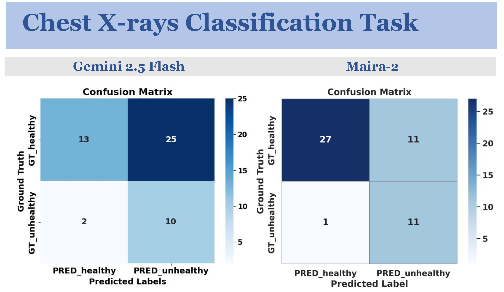
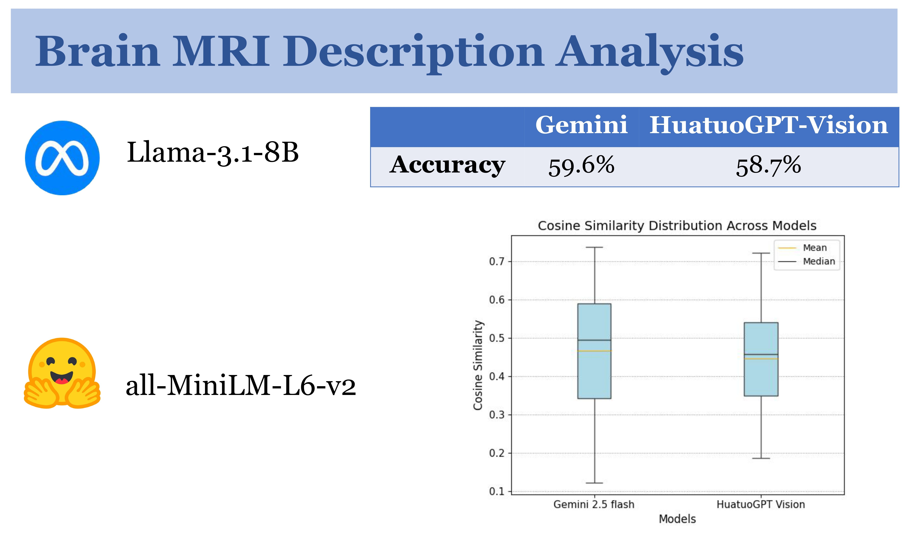
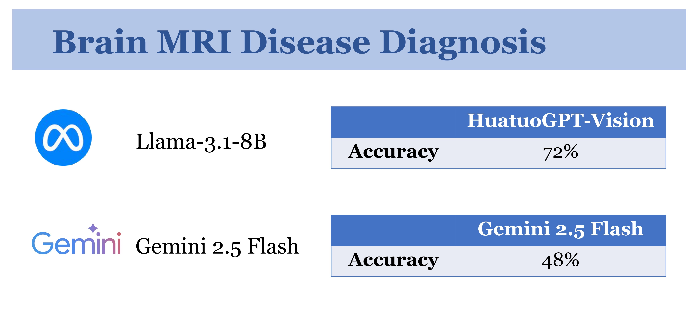

# AI for Vision-Language Models in Medical Imaging

## Setup

1. Clone the repository
```bash
git clone https://github.com/panthibivek/AI-in-Vision-Language-Models-in-Medical-Imaging.git
cd AI-in-Vision-Language-Models-in-Medical-Imaging
```

2. Create and activate virtual environment
```bash
# Create virtual environment
python -m venv venv

# Activate virtual environment (Windows)
.\venv\Scripts\activate
```

3. Install dependencies
```bash
pip install -r code/requirements.txt
```

4. Run example detection
```bash
python src/detect.py
```

## Results

<p align="center">
    
    <br>
    <em>Figure 1: Abnormality detection results from different models on chest X-rays and brain MRI images. The table displays average performance scores across various metrics.</em>
</p>

<p align="center">
    
    <br>
    <em>Figure 2: Confusion matrices of Gemini 2.5 Flash and Maira-2 for disease classification on X-ray images.</em>
</p>

<p align="center">
    
    <br>
    <em>Figure 3: LLM scores and semantic similarity comparison between model-generated descriptions and ground truth annotations.</em>
</p>

<p align="center">
    
    <br>
    <em>Figure 4: Model accuracy comparison for disease diagnosis based on clinical history and image findings.</em>
</p>